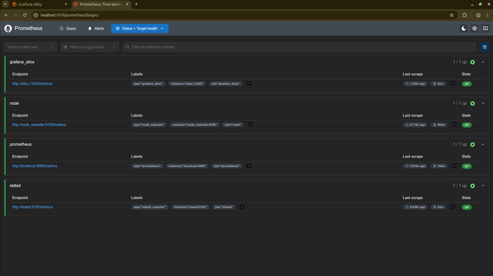

# CDC Data Pipeline Observability

> ⚠️ **Note: This project is currently under active development.** > I am actively building out the core infrastructure, metric collection, and dashboard configurations. 

## 🎯 Project Objective
The goal of this project is to build a robust data pipeline observability framework for Change Data Capture (CDC) workflows. By leveraging **Prometheus** for metric ingestion and **Grafana** for real-time visualization, this setup aims to track pipeline health, throughput, latency, and system bottlenecks.

## 🛠️ Tech Stack & Tools (Planned / In-Progress)
* **CDC Engine:** (e.g., Debezium, Kafka Connect, or your custom extractor)
* **Metrics Ingestion:** Prometheus
* **Visualization:** Grafana
* **Infrastructure:** Docker & Docker Compose (for local orchestration)

## 🚧 Current Status & Roadmap
* [x] Define project architecture and core metrics
* [/] Set up local Docker Compose environment for Prometheus & Grafana *(In Progress)*
* [ ] Configure CDC exporters to expose Prometheus-compatible metrics
* [ ] Build Grafana dashboards for lag tracking and throughput
* [ ] Add alerting rules for pipeline failures

Grafana Dashboard monitoring metrics from prometheus

Prometheus UI monitoring service health
