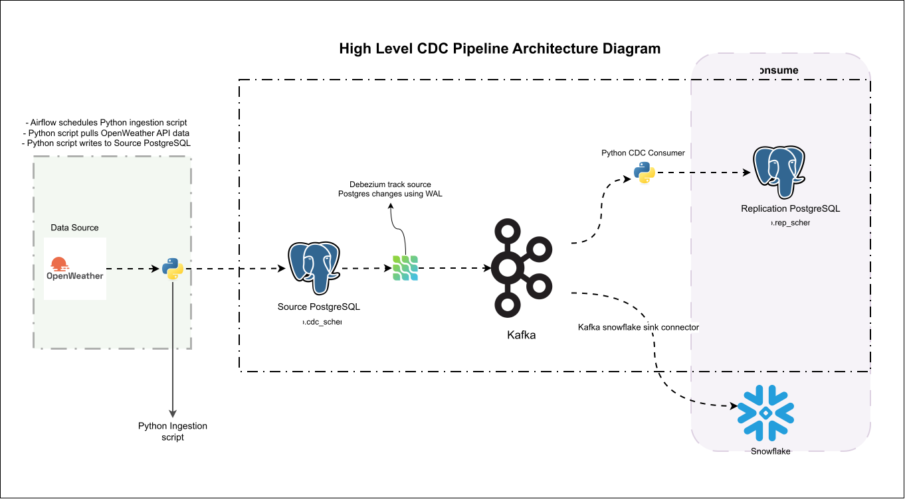
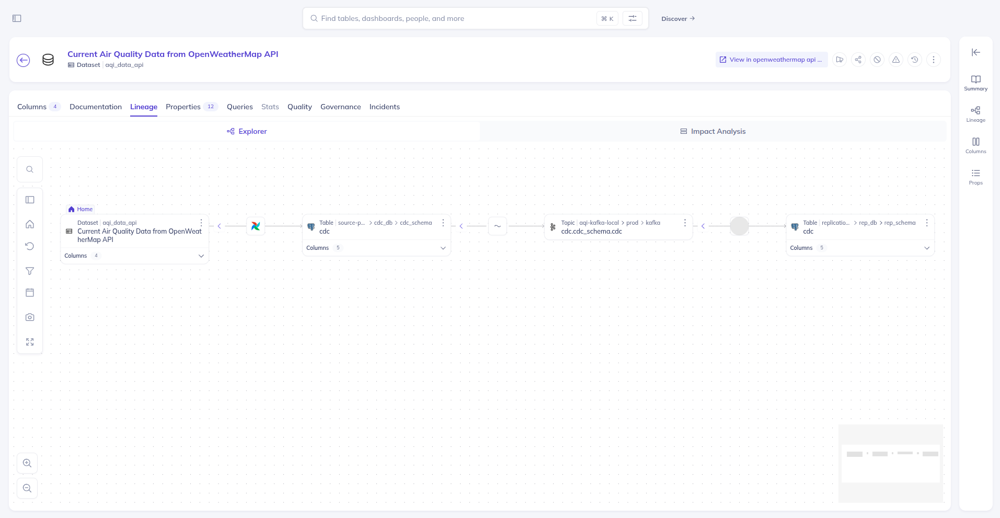
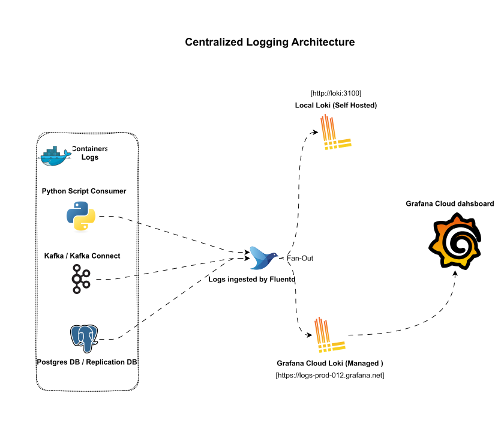
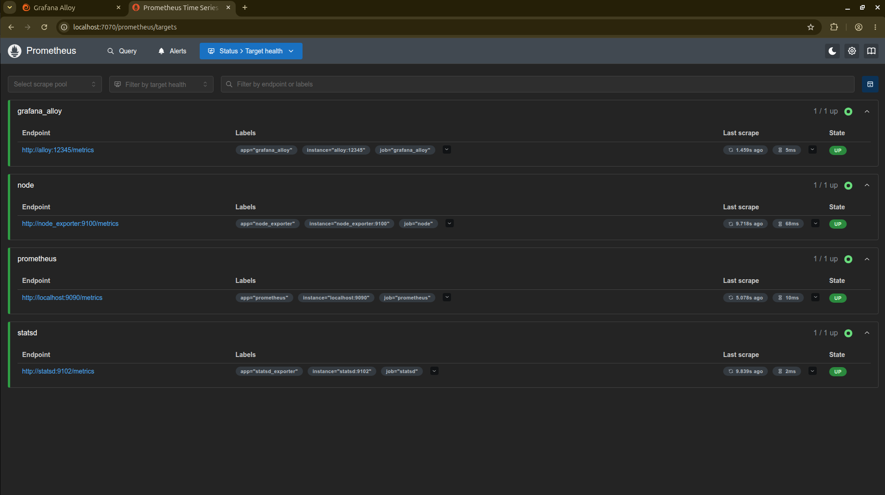

# CDC Air Quality Data Pipeline

This project is an end-to-end Change Data Capture (CDC) data engineering pipeline built around air quality data from the OpenWeatherMap API.

It demonstrates how operational data moves from an API into PostgreSQL, how PostgreSQL changes are captured with Debezium and Kafka, how downstream systems(Snowflake) consume those changes, and how the full system is observed and documented with DataHub, Prometheus, Loki, Grafana.

The project is intentionally local-first, but it also includes a practical hybrid setup where DataHub runs in GitHub Codespaces to avoid laptop memory pressure.

## What This Project Builds

At a high level, the pipeline does this:

```text
OpenWeatherMap API
  -> Airflow producer DAG
  -> Source PostgreSQL
  -> Debezium PostgreSQL connector
  -> Kafka topic
  -> Python CDC consumer
  -> Replication PostgreSQL

Kafka topic
  -> Snowflake Kafka connector sink
  -> Snowflake raw CDC table
  -> Snowflake stream and triggered task
  -> Snowflake clean analytics table

Metadata and lineage
  -> DataHub

Logs and metrics
  -> Fluentd, Loki, Prometheus, Grafana Alloy, Grafana Cloud
```

## Architecture




Data Lineage Image:


## Repository Layout

```text
.
|-- containers/
|   |-- airflow/               # Airflow scheduler, API server, worker, DAG processor
|   |-- datahub/               # DataHub ingestion recipes and custom lineage emitters
|   |-- debezium/              # Debezium PostgreSQL source connector registration
|   |-- fluentd/               # Docker log collection and forwarding
|   |-- grafana/               # Local Grafana service definition
|   |-- grafana_alloy/         # Grafana Alloy remote write bridge
|   |-- kafka/                 # Local Kafka broker
|   |-- kafka-connect/         # Debezium Connect image extended with Snowflake connector
|   |-- loki/                  # Local Loki log store
|   |-- postgres/              # Source and replication PostgreSQL containers
|   |-- postgres_consumer/     # Python CDC consumer container
|   |-- prometheus/            # Prometheus and node exporter
|   |-- proxy_server/          # Nginx reverse proxy for local UIs
|   `-- statsd/                # StatsD exporter for Airflow metrics
|-- infra/                     # Terraform Snowflake infrastructure
|-- images/                    # Architecture and dashboard screenshots
|-- src/
|   |-- elt/fetch.py           # OpenWeatherMap API extraction
|   |-- elt/load.py            # Load validated API data into source PostgreSQL
|   `-- elt/consumer.py        # Kafka CDC consumer into replication PostgreSQL
|-- utils/                     # Logging, PostgreSQL connection helpers, secrets utilities
|-- clean_data.sql             # One-time Snowflake clean table load
|-- standard_view.sql          # Snowflake staging/serving SQL draft using a view
|-- stream_command.sql         # Snowflake stream + triggered task automation
|-- Makefile                   # Local runbook commands
`-- requirements.txt           # Python, Airflow, DataHub, and connector dependencies
```

## Main Components

| Component                       | Role                                                                             |
| ------------------------------- | -------------------------------------------------------------------------------- |
| OpenWeatherMap API              | External source for air pollution readings.                                      |
| Airflow                         | Schedules the hourly producer DAG.                                               |
| Source PostgreSQL               | Stores validated API readings in`cdc_db.cdc_schema.cdc`.                       |
| Debezium                        | Reads PostgreSQL WAL/logical replication changes and writes CDC events to Kafka. |
| Kafka                           | CDC event transport.                                                             |
| Python CDC consumer             | Reads Kafka CDC events and applies them to replication PostgreSQL.               |
| Replication PostgreSQL          | Local replicated target database.                                                |
| Kafka Connect                   | Runs Debezium and Snowflake sink connectors.                                     |
| Snowflake Kafka connector       | Writes Kafka CDC events to Snowflake.                                            |
| Snowflake stream/task           | Converts raw CDC payloads into a clean analytics table.                          |
| DataHub                         | Catalogs datasets, jobs, platforms, and lineage.                                 |
| Fluentd/Loki/Grafana            | Collects and visualizes logs.                                                    |
| Prometheus/StatsD/Grafana Alloy | Collects and forwards metrics.                                                   |

## Data Flow Details

### 1. API Fetch

`src/elt/fetch.py` calls:

```text
http://api.openweathermap.org/data/2.5/air_pollution
```

It extracts these fields from the API response:

| API path          | Meaning                                | Target field    |
| ----------------- | -------------------------------------- | --------------- |
| `main.aqi`      | Air Quality Index from OpenWeatherMap. | `aqi`         |
| `dt`            | Unix timestamp of the reading.         | `date`        |
| `components.co` | Carbon monoxide concentration.         | `co_value`    |
| `components.o3` | Ozone concentration.                   | `ozone_value` |

The response is validated with the Pydantic `AirQualityReading` model in `src/validate.py`.

### 2. Source PostgreSQL Load

`src/elt/load.py` inserts each validated reading into:

```text
cdc_db.cdc_schema.cdc
```

The insert uses this idempotency rule:

```sql
ON CONFLICT (date) DO NOTHING
```

That means if the same reading timestamp is fetched again, the source table will not duplicate the row.

### 3. Debezium CDC Capture

The source PostgreSQL container is configured for logical replication:

```text
wal_level=logical
max_replication_slots=10
max_wal_senders=10
```

The Debezium connector in `containers/debezium/connectors.json` watches:

```text
cdc_schema.cdc
```

and emits changes into this Kafka topic:

```text
cdc.cdc_schema.cdc
```

### 4. Replication PostgreSQL Consumer

`src/elt/consumer.py` reads Debezium JSON messages from Kafka and applies them to:

```text
rep_db.rep_schema.cdc
```

The consumer handles:

| Debezium op | Meaning       | Consumer action      |
| ----------- | ------------- | -------------------- |
| `c`       | Create        | Insert or merge row. |
| `r`       | Snapshot read | Insert or merge row. |
| `u`       | Update        | Update existing row. |
| `d`       | Delete        | Delete existing row. |

The consumer commits the Kafka offset only after the PostgreSQL transaction commits. That gives the project an at-least-once processing model with idempotent writes for inserts.

### 5. Snowflake Sink

The Snowflake Kafka connector reads the same Kafka topic:

```text
cdc.cdc_schema.cdc
```

and writes raw CDC records into Snowflake:

```text
CDC_DB.AQI_SCHEMA."cdc.cdc_schema.cdc"
```

That raw table contains connector metadata and JSON payload columns such as:

```text
RECORD_METADATA
SCHEMA
PAYLOAD
```

This format is useful for ingestion and auditability, but it is not ideal for analytics.

### 6. Snowflake Clean Serving Table

The project creates a cleaner serving table:

```text
AQI_DATA
```

The stream and triggered task in `stream_command.sql` keep this table updated from the raw CDC landing table.

The intended Snowflake model is:

```text
Raw CDC table
  -> Stream on raw table
  -> Triggered task
  -> Clean analytics table
```

The triggered task runs when Snowflake detects new stream data. It is near real-time, not millisecond-instant. The raw Kafka connector table receives the event first; then the stream and task update the clean table.

## Prerequisites

Install these locally:

```text
Docker
Docker Compose
Python 3.11 recommended for DataHub CLI
GitHub CLI
jq
psql client
Terraform, if provisioning Snowflake from scratch
```

DataHub CLI currently warns that Python versions above 3.11 are not actively tested. If you recreate the virtual environment, prefer Python 3.11 for the cleanest DataHub experience.

## Environment and Secrets

Create a local `.env` file at the project root. Do not commit it.

Expected values include:

```bash
WEATHERAPI=<openweathermap_api_key>
LAT=<latitude>
LONG=<longitude>

FERNET_KEY=<airflow_fernet_key>
AIRFLOW__API_AUTH__JWT_SECRET=<airflow_jwt_secret>

GRAFANA_TOKEN=<grafana_cloud_token>
LOKI_USERNAME=<grafana_loki_username>
LOKI_TOKEN=<grafana_loki_token>
```

Snowflake key-pair authentication is used for the Snowflake Kafka connector and DataHub Snowflake ingestion. Keep private keys out of Git.

The project `.gitignore` excludes:

```text
.env
*.p8
terraform.tfstate
*.tfvars
*.jar
logs/
venv/
```

## First-Time Local Setup

From the project root:

```bash
cd /home/royale/Documents/code_files/personal_project/batch/cdc
```

Create and activate a Python virtual environment:

```bash
python3.11 -m venv venv
source venv/bin/activate
pip install -r requirements.txt
```

If any DataHub connector plugin is missing, install the relevant extras:

```bash
pip install 'acryl-datahub[postgres,kafka,kafka-connect,snowflake]'
```

Create the shared Docker network:

```bash
docker network inspect platform-network >/dev/null 2>&1 || docker network create platform-network
```

Create external volumes used by the compose files:

```bash
docker volume create cdc_data
docker volume create replication_data
docker volume create kafka_data
docker volume create loki_data
docker volume create prometheus-data
docker volume create grafana-data
```

If one already exists, Docker will tell you. That is fine.

## Starting the Local CDC Platform

Start the local services:

```bash
make up
```

Check service status:

```bash
make ps
```

Stop services:

```bash
make down
```

Restart services:

```bash
make restart
```

## Important Local Ports

| Service                     | Host port | Notes                                               |
| --------------------------- | --------: | --------------------------------------------------- |
| Source PostgreSQL           |  `5434` | Connects to container port`5432`.                 |
| Replication PostgreSQL      |  `5435` | Connects to container port`5432`.                 |
| Airflow metadata PostgreSQL |  `5433` | Used by the Airflow stack.                          |
| Kafka external listener     | `29092` | Use from the laptop host.                           |
| Kafka internal listener     |  `9092` | Use from Docker containers.                         |
| Kafka controller            |  `9093` | Kafka KRaft controller listener.                    |
| Kafka Connect REST          |  `8083` | Used to register Debezium and Snowflake connectors. |
| Nginx proxy                 |  `7070` | Routes to Airflow and Prometheus.                   |
| Loki                        |  `3100` | Local log store.                                    |
| StatsD UDP                  |  `9125` | Airflow metrics input.                              |
| Grafana Alloy               | `12345` | Alloy UI/health endpoint.                           |
| DataHub GMS tunnel          | `18080` | Local forwarded port to DataHub in Codespaces.      |

## Local UI URLs

Airflow through Nginx:

```text
http://localhost:7070/airflow/
```

Prometheus through Nginx:

```text
http://localhost:7070/prometheus/
```

Loki:

```text
http://localhost:3100
```

DataHub UI is served from GitHub Codespaces. Use the forwarded Codespaces URL for the DataHub frontend, and use `http://127.0.0.1:18080` locally for GMS/API ingestion.

## Registering Kafka Connect Connectors

Start the stack first:

```bash
make up
```

Register the Debezium PostgreSQL source connector:

```bash
make register-connector
```

Check connector status:

```bash
make status-connector
```

List connectors:

```bash
make list-connector
```

Register the Snowflake sink connector:

```bash
bash containers/kafka-connect/connectors/register.sh
```

Check the Snowflake sink connector:

```bash
curl http://localhost:8083/connectors/snowflake-cdc-sink/status | jq
```

The Snowflake connector config lives at:

```text
containers/kafka-connect/connectors/connector.json
```

The registration script injects the private key at runtime so the private key does not need to live inside the JSON file.

## Verifying the CDC Pipeline

Check source PostgreSQL:

```bash
psql -h localhost -p 5434 -U cdc -d cdc_db
```

Example query:

```sql
SELECT *
FROM cdc_schema.cdc
ORDER BY date DESC
LIMIT 5;
```

Check replication PostgreSQL:

```bash
psql -h localhost -p 5435 -U postgres -d rep_db
```

Example query:

```sql
SELECT *
FROM rep_schema.cdc
ORDER BY date DESC
LIMIT 5;
```

Check Kafka topics:

```bash
docker exec -it kafka_service /opt/kafka/bin/kafka-topics.sh \
  --bootstrap-server kafka:9092 \
  --list
```

Read a few Kafka messages:

```bash
docker exec -it kafka_service /opt/kafka/bin/kafka-console-consumer.sh \
  --bootstrap-server kafka:9092 \
  --topic cdc.cdc_schema.cdc \
  --from-beginning \
  --max-messages 5
```

Check the Python consumer logs:

```bash
make log-consumer
```

## Snowflake Setup

Snowflake infrastructure is defined in:

```text
infra/
```

The Terraform configuration creates a Snowflake warehouse and database for the CDC pipeline.

Before running Snowflake SQL manually, make sure your worksheet/session has an active database and schema:

```sql
USE DATABASE CDC_DB;
USE SCHEMA AQI_SCHEMA;
USE WAREHOUSE "cdc-warehouse";
```

If you see:

```text
Cannot perform CREATE VIEW. This session does not have a current database.
```

it means Snowflake does not know which database your unqualified object names belong to. Either run `USE DATABASE CDC_DB`, or use fully qualified object names like `CDC_DB.AQI_SCHEMA.AQI_DATA`.

### One-Time Clean Table Load

Use `clean_data.sql` to create and populate the clean table once:

```sql
CREATE OR REPLACE TABLE aqi_data (
    id INTEGER,
    aqi INTEGER,
    date_epoch INTEGER,
    co_value FLOAT,
    ozone_value FLOAT
);
```

Then the `MERGE` reads from the raw Snowflake connector table:

```text
"cdc.cdc_schema.cdc"
```

and upserts into:

```text
aqi_data
```

This is a one-time command. It does not keep the clean table updated automatically.

### Automated Clean Table Refresh

Use `stream_command.sql` for the automated approach:

```text
Raw Snowflake CDC table
  -> aqi_data_stream
  -> refresh_aqi_data_task
  -> aqi_data
```

The stream is created on the raw connector table:

```sql
CREATE STREAM IF NOT EXISTS aqi_data_stream
ON TABLE "cdc.cdc_schema.cdc";
```

The task uses:

```sql
WHEN SYSTEM$STREAM_HAS_DATA('aqi_data_stream')
```

That means the task runs only when Snowflake detects unconsumed stream data.

Resume the task after creating it:

```sql
ALTER TASK refresh_aqi_data_task RESUME;
```

Check task status:

```sql
SHOW TASKS LIKE 'REFRESH_AQI_DATA_TASK';
```

Check task history:

```sql
SELECT *
FROM TABLE(INFORMATION_SCHEMA.TASK_HISTORY(
    TASK_NAME => 'REFRESH_AQI_DATA_TASK'
))
ORDER BY SCHEDULED_TIME DESC;
```

Check the clean table:

```sql
SELECT *
FROM aqi_data
ORDER BY date_epoch DESC;
```

## DataHub Deployment Model

DataHub was moved to GitHub Codespaces because running the full DataHub quickstart stack locally consumed too much memory alongside Kafka, Airflow, PostgreSQL, and observability services.

The final model is:

```text
Laptop:
  CDC stack
  DataHub CLI
  Airflow
  Source PostgreSQL
  Replication PostgreSQL
  Kafka
  Kafka Connect

Codespaces:
  DataHub quickstart containers

Tunnel:
  Codespaces DataHub GMS port 8080
  -> laptop local port 18080
```

### Start DataHub in Codespaces

In the Codespaces terminal, start DataHub:

```bash
datahub docker quickstart --kafka-broker-port 39092
```

The `--kafka-broker-port 39092` flag avoids conflict with the local CDC Kafka service that already uses port `9092`.

If you use a generated quickstart compose file instead, make sure the DataHub Kafka external published port is not fighting with the CDC Kafka broker.

### Forward DataHub GMS to the Laptop

Run this on the laptop, not inside Codespaces:

```bash
gh codespace list
```

Then forward remote DataHub GMS port `8080` to local port `18080`:

```bash
gh codespace ports forward 8080:18080 -c <codespace-name>
```

Example:

```bash
gh codespace ports forward 8080:18080 -c improved-orbit-pw6jqp4jpp6fr456
```

The terminal will show something like:

```text
Forwarding ports: remote 8080 <=> local 18080
```

That terminal is supposed to remain open. It is the tunnel.

If GitHub CLI complains about missing Codespaces permissions, refresh the auth scope:

```bash
gh auth refresh -h github.com -s codespace
```

### Test the DataHub Endpoint

From a second laptop terminal:

```bash
curl -i http://127.0.0.1:18080/config
```

An HTTP `200` response means the laptop can reach DataHub GMS through the tunnel.

### Endpoint Rules

Use the right address depending on where the process is running:

| Process location            | DataHub GMS URL                       |
| --------------------------- | ------------------------------------- |
| Laptop terminal             | `http://127.0.0.1:18080`            |
| DataHub CLI on laptop       | `http://127.0.0.1:18080`            |
| Airflow container on laptop | `http://host.docker.internal:18080` |
| Codespaces terminal         | `http://localhost:8080`             |

This distinction matters. Inside a Docker container, `localhost` points to that container, not the laptop.

The Airflow compose file uses:

```yaml
extra_hosts:
  - "host.docker.internal:host-gateway"
```

That gives Airflow containers a hostname that routes back to the laptop host, where the Codespaces tunnel is listening.

## DataHub Airflow Metadata

The Airflow container image installs:

```text
acryl-datahub-airflow-plugin
```

The Airflow Docker Compose configuration sets:

```yaml
AIRFLOW_DATAHUB_ENABLED: "true"
AIRFLOW_DATAHUB_CONN_ID: "datahub_rest_default"
AIRFLOW_CONN_DATAHUB_REST_DEFAULT: "datahub-rest://host.docker.internal:18080"
```

When the scheduler starts, the DataHub listener should initialize.

Check scheduler logs:

```bash
docker logs airflow-airflow-scheduler-1 | grep -i datahub
```

Check from inside the scheduler container:

```bash
docker exec airflow-airflow-scheduler-1 python -c 'import requests; print(requests.get("http://host.docker.internal:18080/config", timeout=10).status_code)'
```

Expected output:

```text
200
```

After the DAG runs, DataHub should show:

```text
Pipeline: producer_dag
Task: load
```

## DataHub Ingestion Recipes

DataHub ingestion recipes live in:

```text
containers/datahub/
```

Configured sources:

| Recipe                             | Purpose                                                        |
| ---------------------------------- | -------------------------------------------------------------- |
| `source-postgres.dhub.yaml`      | Ingest source PostgreSQL metadata.                             |
| `replication-postgres.dhub.yaml` | Ingest replication PostgreSQL metadata.                        |
| `cdc-kafka.dhub.yaml`            | Ingest Kafka topic metadata.                                   |
| `kafka-connect.dhub.yaml`        | Ingest Kafka Connect connector metadata.                       |
| `snowflake.dhub.yaml`            | Ingest Snowflake tables, streams, tasks, and related metadata. |

The recipes use stable `platform_instance` values so DataHub URNs remain predictable:

| Source                 | `platform_instance`    |
| ---------------------- | ------------------------ |
| Source PostgreSQL      | `source-postgres`      |
| Replication PostgreSQL | `replication-postgres` |
| Kafka                  | `aqi-kafka-local`      |
| Kafka Connect          | `cdc-kafka-connect`    |
| Snowflake              | `cdc-snowflake`        |

Keep these values stable after real ingestion. Changing them later creates new DataHub assets because the value becomes part of the asset URN.

## Running DataHub Metadata Ingestion

Keep the Codespaces port-forward terminal open before running these commands.

Source PostgreSQL:

```bash
datahub ingest -c containers/datahub/source-postgres.dhub.yaml --test-source-connection
make postgres-preview
make ingest-postgres
```

OpenWeatherMap custom API dataset and lineage:

```bash
make ingest-api
```

Kafka topic:

```bash
make kafka-preview
make kafka-ingest
```

Source PostgreSQL to Kafka lineage:

```bash
make kafka-lineage
```

Kafka Connect:

```bash
make kafka-connect-preview
make kafka-connect-ingest
```

Replication PostgreSQL:

```bash
make replication-preview
make replication-ingest
```

Kafka topic to Python consumer to replication PostgreSQL lineage:

```bash
make kafka-rep
```

Snowflake:

```bash
make snowflake-preview
make snowflake-ingest
```

For any source, the safe run sequence is:

```bash
datahub ingest -c <recipe> --test-source-connection
datahub ingest -c <recipe> --preview --dry-run
datahub ingest -c <recipe> --dry-run
datahub ingest -c <recipe>
```

The first three commands test connectivity and output without writing metadata. The final command writes metadata to DataHub.

## Implemented DataHub Lineage

The project models lineage at the right production abstraction level:

```text
OpenWeatherMap API dataset
  -> Airflow dataJob producer_dag.load
  -> Source PostgreSQL table
  -> Kafka topic
  -> Python CDC consumer dataJob
  -> Replication PostgreSQL table
```

Important modeling decision:

`fetch.py` and `load.py` are implementation details inside the Airflow task. The Airflow task `producer_dag.load` is the job DataHub should track because it is the scheduled, monitored, retryable execution unit.

Ingestion recipes configure DataHub connectors to discover metadata and supported lineage from your systems. The scripts in `customPlatforms` add custom assets, such as the OpenWeatherMap API dataset and Python consumer job, and explicitly define relationships between systems. Together, they help DataHub show how data flows through the pipeline. These scripts update DataHub's catalog; the actual data movement is handled by Airflow, Debezium, and the Python consumer.

The custom DataHub scripts are:

| Script                                                         | Purpose                                                                                    |
| -------------------------------------------------------------- | ------------------------------------------------------------------------------------------ |
| `containers/datahub/customPlatforms/weathermap_api.py`       | Registers OpenWeatherMap as a custom platform and adds API to Airflow to Postgres lineage. |
| `containers/datahub/customPlatforms/kafka_lineage.py`        | Adds source PostgreSQL table to Kafka topic lineage.                                       |
| `containers/datahub/customPlatforms/kafka_rep_db_lineage.py` | Registers the Python consumer job and links Kafka topic to replication PostgreSQL.         |

Snowflake metadata ingestion is configured separately. If DataHub does not infer the Kafka topic to Snowflake raw table lineage from Kafka Connect metadata, add a custom emitter for:

```text
Kafka topic
  -> Snowflake raw CDC table
  -> Snowflake clean AQI_DATA table
```

## Observability

### Logs

Docker services send logs to Fluentd using the Docker Fluentd logging driver.

Fluentd forwards logs to:

```text
Local Loki
Grafana Cloud Loki
```

Config files:

```text
containers/fluentd/conf/fluent.conf
containers/loki/config/loki_config.yaml
```

### Metrics

Airflow emits StatsD metrics:

```yaml
AIRFLOW__METRICS__STATSD_ON: 'true'
AIRFLOW__METRICS__STATSD_HOST: statsd
AIRFLOW__METRICS__STATSD_PORT: 9125
AIRFLOW__METRICS__STATSD_PREFIX: airflow
```

Prometheus scrapes:

```text
Prometheus itself
Node exporter
StatsD exporter
Grafana Alloy
```

Grafana Alloy forwards metrics to Grafana Cloud.

Config files:

```text
containers/prometheus/prometheus.yml
containers/grafana_alloy/config.alloy
```

Architecture images:







## Tradeoffs and Lessons Learned

### DataHub ran in Codespaces instead of locally

Running DataHub locally alongside Kafka, Airflow, PostgreSQL, Kafka Connect, Prometheus, Loki, and Grafana components created memory pressure on the laptop.

The practical workaround was to run DataHub in GitHub Codespaces and forward DataHub GMS back to the laptop with:

```bash
gh codespace ports forward 8080:18080 -c <codespace-name>
```

Tradeoff:

```text
Pros:
  Less local memory pressure.
  CDC stack can keep running locally.

Cons:
  The port-forward terminal must stay open.
  Codespaces can stop when inactive.
  If the Codespace or DataHub volumes are deleted, metadata must be re-ingested.
```

### DataHub Kafka port conflict

DataHub quickstart includes its own internal Kafka broker. The local CDC pipeline also uses Kafka.

The conflict happened because both wanted host port `9092`.

The solution was to move DataHub quickstart Kafka's exposed port away from `9092`, for example:

```bash
datahub docker quickstart --kafka-broker-port 39092
```

Important distinction:

```text
CDC Kafka:
  Carries business CDC events.

DataHub quickstart Kafka:
  Internal DataHub infrastructure.
```

They should be treated as separate Kafka systems.

### No Schema Registry in this project

This project uses JSON converters with schemas disabled:

```text
value.converter = org.apache.kafka.connect.json.JsonConverter
value.converter.schemas.enable = false
```

That made the first project easier to build and debug.

Tradeoff:

```text
Pros:
  Less infrastructure.
  Easier to inspect Kafka messages as JSON.
  Simpler Python consumer.

Cons:
  Weaker schema governance.
  DataHub cannot infer rich Kafka field schemas from Schema Registry.
  Future consumers have fewer compatibility guarantees.
```

In a production version, add Schema Registry and use Avro, Protobuf, or JSON Schema with compatibility rules.

### Raw Snowflake CDC table is not an analytics table

The Snowflake Kafka connector writes raw CDC envelopes containing metadata and payload JSON.

That is good for replay, audit, and debugging, but not for analytics users.

The project solved this by adding:

```text
Raw table
  -> Stream
  -> Triggered task
  -> Clean table
```

### Stateful DataHub ingestion needs a pipeline name

When `stateful_ingestion.enabled: true` is used, DataHub requires:

```yaml
pipeline_name: "some-stable-name"
```

Without it, ingestion fails because DataHub cannot track the previous run state.

### Run ingestion where both systems are reachable

The DataHub CLI must connect to:

```text
The source system
DataHub GMS
```

Because the CDC sources run locally, the DataHub ingestion commands are run on the laptop, not inside Codespaces.

The laptop can reach local Postgres/Kafka/Kafka Connect directly and can reach Codespaces DataHub through the tunnel.

## Common Troubleshooting

### `Connection refused` to `host.docker.internal:18080`

Usually means one of these is true:

```text
The Codespaces port-forward terminal is not running.
DataHub in Codespaces is stopped.
Airflow is using localhost instead of host.docker.internal.
The laptop port 18080 is not listening.
```

Check from the laptop:

```bash
curl -i http://127.0.0.1:18080/config
```

Check from the Airflow scheduler container:

```bash
docker exec airflow-airflow-scheduler-1 python -c 'import requests; print(requests.get("http://host.docker.internal:18080/config", timeout=10).status_code)'
```

### DataHub UI works but ingestion cannot reach DataHub

The UI and GMS API are different endpoints. For ingestion, test GMS:

```bash
curl -i http://127.0.0.1:18080/config
```

### `Cannot open config file`

The recipe path is wrong. Run ingestion from the project root:

```bash
cd /home/royale/Documents/code_files/personal_project/batch/cdc
```

Then use:

```bash
datahub ingest -c containers/datahub/source-postgres.dhub.yaml
```

### `pipeline_name must be provided if stateful ingestion is enabled`

Add a top-level `pipeline_name` to the DataHub recipe:

```yaml
pipeline_name: "source-postgres-ingestion"
```

### Postgres source is disabled in DataHub CLI

The current Python environment may not have the Postgres connector extras installed.

Check plugins:

```bash
datahub check plugins
```

Install extras if needed:

```bash
pip install 'acryl-datahub[postgres]'
```

### Snowflake says there is no current database

Run:

```sql
USE DATABASE CDC_DB;
USE SCHEMA AQI_SCHEMA;
```

or use fully qualified names:

```sql
CDC_DB.AQI_SCHEMA.AQI_DATA
```

### Snowflake `MERGE` syntax errors

Check for trailing commas before:

```text
FROM
WHEN MATCHED
WHEN NOT MATCHED
)
```

Snowflake SQL is strict about trailing commas in `SELECT`, `UPDATE SET`, `INSERT`, and `VALUES` lists.

### IDs are not sorted in query results

SQL tables are unordered by default. Use:

```sql
SELECT *
FROM aqi_data
ORDER BY id;
```

or:

```sql
SELECT *
FROM aqi_data
ORDER BY date_epoch DESC;
```

### DataHub metadata disappears after deleting Codespaces

DataHub quickstart stores metadata in its own backing services. If the Codespace or its Docker volumes are removed, the metadata catalog must be rebuilt by rerunning the DataHub ingestion commands and custom emitters.

### Codespaces Docker disk is too low

Check usage:

```bash
docker system df
df -h
```

Safe cleanup:

```bash
docker system prune
docker builder prune
```

More aggressive cleanup:

```bash
docker system prune -a
```

Only prune volumes if you are comfortable losing local DataHub state:

```bash
docker volume prune
```

## Production Hardening Checklist

For a real production version, improve these areas:

```text
Secrets:
  Move database passwords and API keys fully out of source code and into a secret manager.

Schema governance:
  Add Schema Registry and use Avro, Protobuf, or JSON Schema.

Data contracts:
  Define ownership, freshness expectations, and schema compatibility rules.

CDC reliability:
  Add dead-letter topics for bad messages.
  Track consumer lag.
  Alert on connector failure and task failure.

Data quality:
  Add validation checks on source PostgreSQL, replication PostgreSQL, and Snowflake clean tables.

Snowflake modeling:
  Keep raw, staging, core, and mart layers separate.
  Add clustering or incremental strategies only when data volume justifies it.

DataHub:
  Add owners, glossary terms, descriptions, tags, and domain ownership.
  Add custom Snowflake lineage if the connector lineage is not automatically inferred.

Operations:
  Remove hard-coded local service assumptions.
  Avoid relying on one laptop for infrastructure.
  Use managed Kafka, managed Airflow, managed Postgres, and persistent DataHub storage when appropriate.
```

## Final Project Status

Implemented:

```text
OpenWeatherMap API extraction
Airflow hourly producer DAG
Source PostgreSQL load
Debezium PostgreSQL CDC
Kafka CDC topic
Python replication consumer
Replication PostgreSQL target
Snowflake Kafka sink connector
Snowflake clean serving table
Snowflake stream and triggered task automation
Docker-based local observability
DataHub metadata ingestion recipes for PostgreSQL, Kafka, Kafka Connect, Airflow, and Snowflake
Custom DataHub lineage for API, Airflow, Kafka, and replication consumer
```

Remaining optional improvement:

```text
Add explicit custom DataHub lineage for Kafka topic -> Snowflake raw table -> Snowflake clean table if it is not inferred from Kafka Connect and Snowflake metadata.
```
